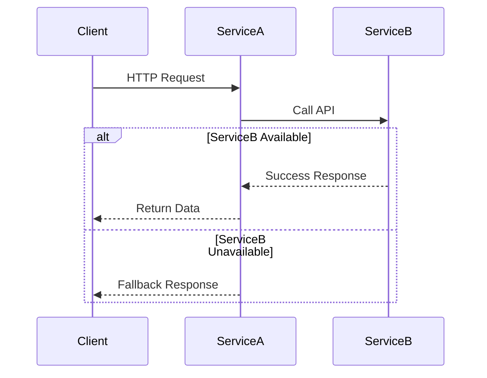
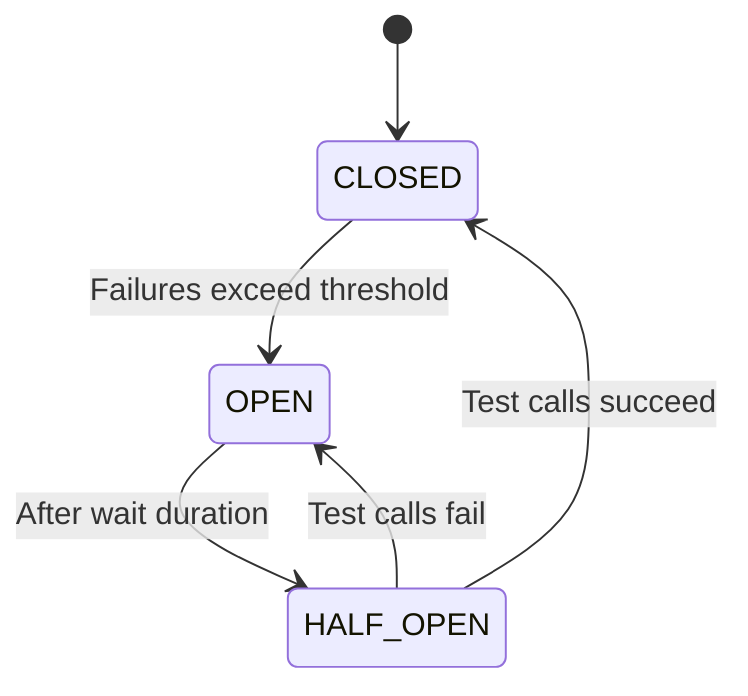
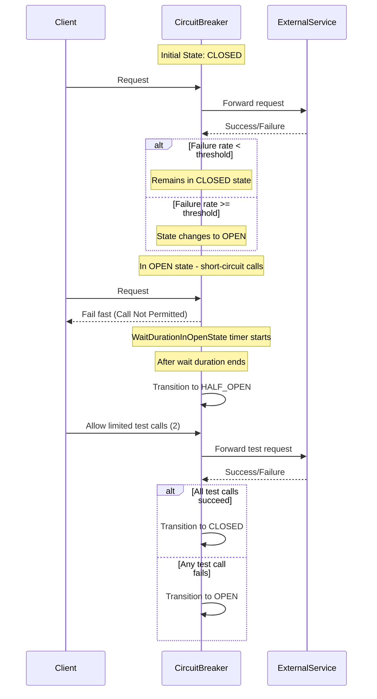

# 📌 sb-resilience4j-circuit-breaker-service

## **Table of Contents**

1. [Introduction](#1-introduction)
2. [Architecture Overview](#2-architecture-overview)
3. [Circuit Breaker States & Behavior](#3-circuit-breaker-states--behavior)
4. [Key Features](#4-key-features)
5. [Configuration Details](#5-configuration-details)
6. [Monitoring & Metrics](#6-monitoring--metrics)
7. [Testing Scenarios](#7-testing-scenarios)
8. [How to Run](#8-how-to-run)
9. [Best Practices](#9-best-practices)
10. [Troubleshooting](#10-troubleshooting)

---

## **1. Introduction**

This project demonstrates the **Circuit Breaker Pattern** using **Resilience4j** in a **Spring Boot (Java 21)**
microservice architecture.

It consists of two independent services:

* **Service A**: Calls Service B and is protected by a circuit breaker.
* **Service B**: Simulates an upstream provider that Service A depends on.

### ✅ Highlights:

* Graceful degradation using fallback methods
* Circuit breaker state transitions
* Retry simulation with logging
* Monitoring via Spring Actuator
* Slf4j-based structured logging

---

## **2. Architecture Overview**

### **Service Interaction Flow**



### **Circuit Breaker State Transitions**



---

## **3. Circuit Breaker States & Behavior**

### **What is a Circuit Breaker?**

The circuit breaker is a resiliency pattern that protects applications from calling unresponsive services repeatedly,
thereby avoiding resource exhaustion and ensuring system stability.

### **States and Transitions**

| State          | Description                             | Trigger Condition          |
|----------------|-----------------------------------------|----------------------------|
| **CLOSED**     | Normal operation, requests pass through | Initial state              |
| **OPEN**       | Short-circuits requests, uses fallback  | Failure threshold exceeded |
| **HALF\_OPEN** | Allows limited test requests            | After wait duration        |

---

### **Sequence Diagram: State Transitions**



---

## **4. Key Features**

### **Resilience Mechanisms**

* ✅ Circuit Breaker via Resilience4j
* 🔄 Retry logic (optional)
* 🚦 Rate Limiter (optional)
* 🔄 Graceful fallback on failure

### **Observability**

* Spring Actuator endpoints
* Circuit breaker metrics and events
* Compatible with Prometheus & Grafana

---

## **5. Configuration Details**

### **Core Resilience4j Settings**

| Property                  | Value | Description                                |
|---------------------------|-------|--------------------------------------------|
| `failureRateThreshold`    | 50%   | % of failed calls to trip circuit          |
| `waitDurationInOpenState` | 5s    | Time in OPEN state before testing recovery |
| `slidingWindowSize`       | 10    | No. of calls considered for failure ratio  |
| `minimumNumberOfCalls`    | 5     | Required calls before evaluating failures  |

### **Actuator Endpoints**

| Endpoint                         | Description                           |
|----------------------------------|---------------------------------------|
| `/actuator/health`               | General application health check      |
| `/actuator/circuitbreakers`      | Shows circuit breaker state & metrics |
| `/actuator/circuitbreakerevents` | Detailed state change logs            |

---

## **6. Monitoring & Metrics**

### **Exposed Metrics**

* Call success/failure counts
* Circuit breaker state transitions
* Event history per circuit

### **Grafana Dashboard (Optional)**

You can integrate metrics with Prometheus and visualize using Grafana:


---

## **7. Testing Scenarios**

### ✅ Suggested Test Cases

1. **Happy Path**

    * Ensure Service B is up, and calls from Service A succeed.

2. **Failure Simulation**

    * Shut down Service B or return 5xx errors and verify circuit opens.

3. **Recovery Verification**

    * Bring back Service B, and check HALF\_OPEN → CLOSED transition after successful test calls.

4. **Fallback Behavior**

    * Confirm fallback method is invoked when Service B is down.

---

## **8. How to Run**

### **Prerequisites**

* Java 21
* Maven 3.6+ or Gradle (depending on setup)
* Optional: Docker for service isolation

### **Steps**

```bash
# Start Service B (provider)
cd service-b
mvn spring-boot:run

# Start Service A (consumer)
cd service-a
mvn spring-boot:run
```

### **Verify Circuit Breaker**

```bash
curl http://localhost:8080/a
```

---

## **9. Best Practices**

### 🔧 Configuration Tips

* Use fallback methods for every remote call
* Tune thresholds and wait durations based on SLA
* Monitor `circuitbreaker.events` for production readiness
* Avoid global exception catching in fallback methods

### 🛡️ Production Readiness

* Enable distributed tracing (e.g., Sleuth or OpenTelemetry)
* Secure actuator endpoints
* Enable metrics publishing to Prometheus

---

## **10. Troubleshooting**

| Issue                          | Cause                       | Solution                                    |
|--------------------------------|-----------------------------|---------------------------------------------|
| Circuit not opening            | Too few failed calls        | Increase `minimumNumberOfCalls`             |
| Fallback method not triggering | Exception type not matched  | Ensure correct exception is handled         |
| No circuit state monitoring    | Missing actuator dependency | Add `spring-boot-starter-actuator`          |
| `CallNotPermittedException`    | Circuit in OPEN state       | Wait for reset period or fix upstream issue |

Check detailed events:

```bash
curl http://localhost:8080/actuator/circuitbreakerevents
```

---

## 📦 Slf4j Logging

### Logger Setup

Make sure to add this dependency in your `build.gradle` or `pom.xml`:

```xml

<dependency>
    <groupId>org.slf4j</groupId>
    <artifactId>slf4j-api</artifactId>
</dependency>
<dependency>
<groupId>org.slf4j</groupId>
<artifactId>slf4j-simple</artifactId> <!-- or logback-classic -->
</dependency>
```

### Usage Example

```java

@Slf4j
@RestController
@RequestMapping("/a")
public class ServiceAController {

    @GetMapping
    @CircuitBreaker(name = "serviceA", fallbackMethod = "serviceAFallback")
    public String callServiceB() {
        log.info("Calling Service B...");
        // ...
    }

    public String serviceAFallback(Exception e) {
        log.error("Service B failed. Executing fallback.", e);
        return "This is a fallback response";
    }
}
```

---